# Regularization

**Avoid overfitting**

**When overfitting, we often see large weights**

Idea: penalize large parameter values

## Ridge regression

**L2 regularized** linear least squares regression:

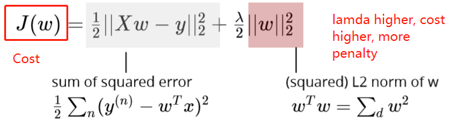

Side note L2 norm:

* regularization parameter  λ &gt; 0 controls the strength of regularization
* a good practice is to not penalize the intercept

## Ridge weight formula

## Ridge with data normalization

**Without regularization**: 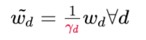

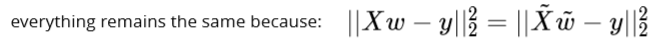

**With regularization**: 

Diff features will be penalized differently

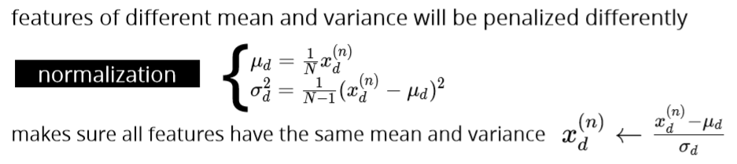

**Instead of maximize log-likelihood, we maximize the posterior**

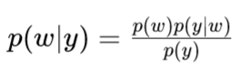

## Maximum a Posteriori \(MAP\)

## Gaussian prior

## Laplace prior

Lasso 

## L1 vs L2 regularization

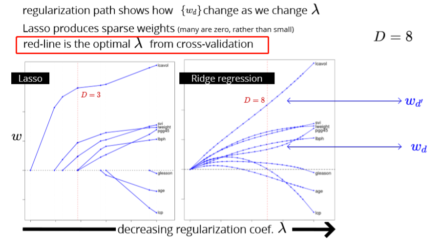

## Diff regularization subset selection

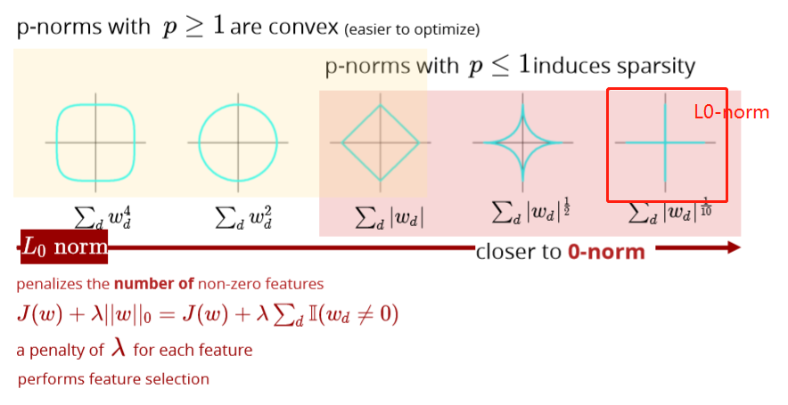

optimizing this is a difficult combinatorial problem:

* search over all    2^D     subsets

## L1 VS L0

It’s just like LASSO but has a little difference. LASSO has a limit:

the L1 norm of the parameters &lt; t \(some constant threshold\)

For L0 regularization. The constraint is the number of parameters &lt; t \(some constant threshold\)

Most people never heard about it because LASSO is good enough in the cases that people want to punish some parameters to zero. L0 regularization shares the same function with it. **The difference is L0 is more extreme than L1. The parameters are much easier to be punished to zero.**

If you have 500 features in the pool and you want 10 of them left, you can try LASSO. However, if you have 10k features in the pool and you want 10 of them left, you probably want to try L0 regularization.

## Bias-variance decomposition

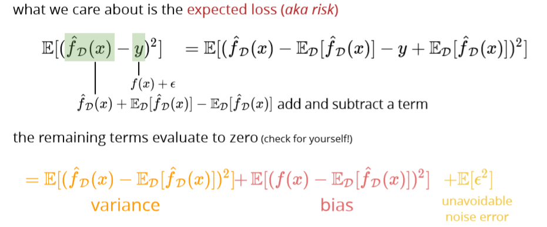

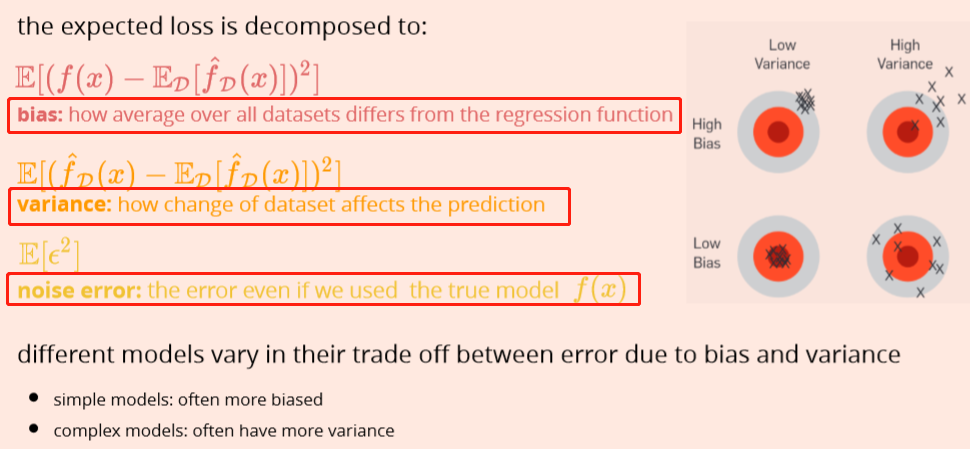

Larger regularization penalty -&gt; high bias – low variance

high variance in more complex models means that test and training error can be very different

high bias in simplistic models means that training error can be high

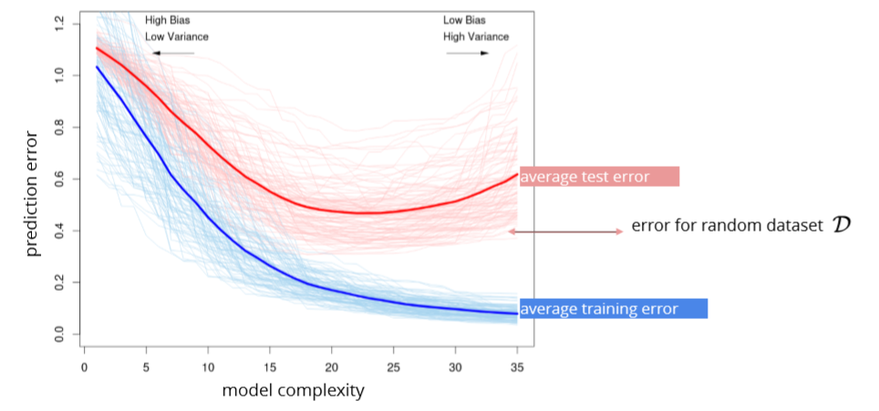

## Cross validation

k-fold CV

leave-one-out CV:extreme case of k=N

Test data:

once the hyper-parameters are selected, we can use the whole set for training use test set for the **final** assessment

## Evaluation

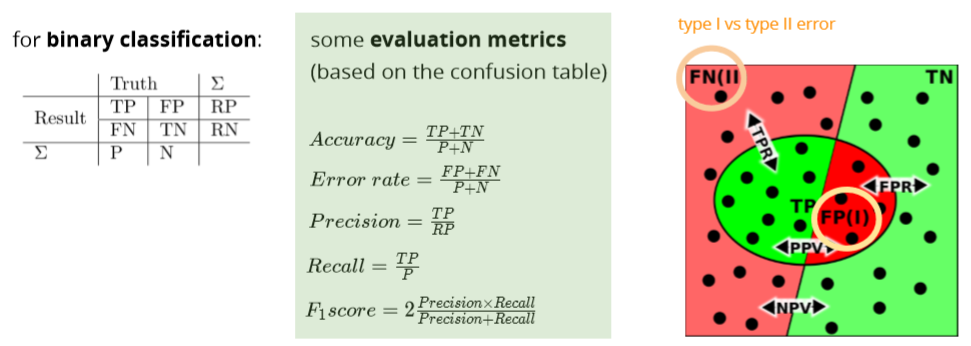

ROC receiver operating characteristic

How to graph: [https://acutecaretesting.org/en/articles/roc-curves-what-are-they-and-how-are-they-used](https://acutecaretesting.org/en/articles/roc-curves-what-are-they-and-how-are-they-used)

## 

